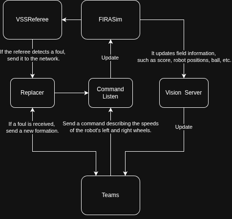

# FIRAClient RAS UFAL

Este repositório tem como objetivo fornecer um roteiro para a configuração do ambiente de desenvolvimento de aplicações para competições de **Futebol de Tamanho Muito Pequeno (VSSS)**. Ele também serve como um repositório centralizado para algoritmos, exemplos e implementações de referência que podem ser reutilizados e ampliados em projetos VSSS.

## Environment Workflow 

- **FIRASim**: Environment simulator used to run and test VSSS league matches, providing the field, robots, and the physical dynamics of the game.

- **VSSReferee**: System responsible for match control and refereeing, managing game states, rules, fouls, and official communication with the teams.

<p align="center">
  
</p>

For more information and references:
- [IEEE Very Small Size Soccer League](https://vsssleague.github.io/vss/index.html)
- [FIRASim Official Simulator](https://vsssleague.github.io/vss/sim.html)
- [VSSS Referee Documentation](https://github.com/VSSSLeague/VSSReferee)

## Behaviour Tree

Behaviour Trees (BTs) are a control architecture widely used in robotics to model decision-making and task execution in a modular, hierarchical, and reactive way. They allow complex robot behaviors to be built by composing simple actions and conditions, improving readability, reusability, and maintainability of the control logic.

In the context of the **Very Small Size Soccer (VSSS)** league, Behaviour Trees are used to coordinate high-level robot strategies, such as positioning, ball approach, passing, and shooting. By reacting to the dynamic game state provided by the simulator and referee system, BTs enable robots to adapt their behavior in real time, ensuring robust and flexible decision-making during matches.

<p align="center">
  
</p>

In this environment, we use the **BehaviorTree.CPP** library for implementing Behaviour Trees and **Groot2** as a graphical tool for editing, monitoring, and visualizing the execution of the trees at runtime.

For more information and references:
- [Introduction to behavior trees](https://robohub.org/introduction-to-behavior-trees/)
- [Groot / Groot2 Documentation](https://www.behaviortree.dev/groot/)
- [BehaviorTree.CPP Documentation](https://www.behaviortree.dev)


## Environment Setup

This section describes how to install and configure all required tools and libraries to run and develop applications for the **Very Small Size Soccer (VSSS)** environment on Ubuntu.

---

### Requirements

The following dependencies are required:

- **g++** (tested with version 9.3.0)
- **Qt** (tested with version 5.12.8)
- **Qt OpenGL**
- **Google Protocol Buffers** (tested with `protoc` v3.6.1)

#### Install base dependencies
```bash
$ sudo apt update
$ sudo apt-get install git build-essential cmake qt5-default libqt5opengl5-dev libgl1-mesa-dev libglu1-mesa-dev libprotobuf-dev protobuf-compiler libode-dev libboost-dev
```

#### Install Google Protocol Buffers
```bash
$ sudo apt install -y protobuf-compiler libprotobuf-dev
```

Verify installation:
```bash
$ protoc --version
```

---

### FIRASim

**FIRASim** is the official simulator used for the VSSS league, providing the physical environment, robots, and ball dynamics. To access the official installation information, follow these steps [FIRASim - INSTALL](https://github.com/IEEEVSS/FIRASim/blob/master/INSTALL.md).

#### Installation

Clone FIRASim into your preferred location.

```bash
$ cd /path/to/firasim_ws
$ git clone https://github.com/IEEEVSS/FIRASim.git
$ cd FIRASim
```

Create a build directory within the project (this is ignored by .gitignore):

```bash
$ mkdir build
$ cd build
```

Run CMake to generate the makefiles:

```bash
$ cmake ..
```

Then compile the program:

```bash
$ make
```
The binary is copied to the ../bin folder after a successful compilation.

#### Run FIRASim
```bash
$ ./FIRASim
```

---

### VSSReferee

**VSSReferee** is responsible for game control and refereeing, managing match states, rules, and communication with teams.

#### Installation
```bash
$ git clone https://github.com/VSSSLeague/VSSReferee
$ cd VSSReferee
$ mkdir build && cd build
$ cmake ..
$ make
```

The binary is copied to the ../bin folder after a successful compilation.

#### Run VSSReferee
```bash
$ ./VSSReferee
```

---

### Groot2

**Groot2** is a graphical tool used to design, edit, and visualize **Behaviour Trees** at runtime.

#### Installation (precompiled installer)
1. Download the Linux installer from the official repository.
2. Make the installer executable:
```bash
chmod +x Groot2-*-linux-installer.run
```

3. Run the installer:
```bash
./Groot2-*-linux-installer.run
```

---

### BehaviourTree.CPP

**BehaviorTree.CPP** is a C++ library used to implement Behaviour Trees for robotic decision-making.

#### Installation from source
```bash
$ git clone https://github.com/BehaviorTree/BehaviorTree.CPP.git
$ cd BehaviorTree.CPP
$ mkdir build && cd build
$ cmake ..
$ make -j$(nproc)
$ sudo make install
```

#### Verify installation
```bash
$ pkg-config --modversion behaviortree_cpp
```